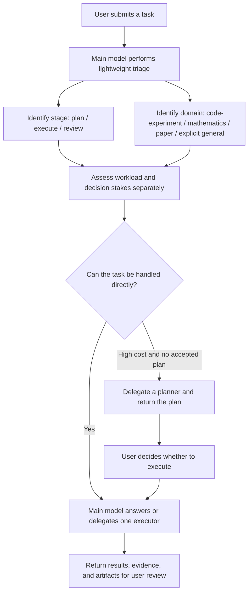

# Agent Academic Squad

**English** | [简体中文](README.zh-CN.md)

A lightweight Codex skill for academic-first task routing, with explicit opt-in for other work.

It can activate implicitly for clearly academic work when routing is likely to provide material value. A formal `$agent-academic-squad` invocation or a positive `小分队...` request can explicitly opt in nonacademic work as well. Reading one file or webpage, or making one tool call, is not enough by itself; the squad becomes useful when the task needs planning, coordination, broad artifact processing, specialized skills, or independent review.

## What it solves

Academic work usually falls into three domains:

- **Code and experiments:** planning, implementation, debugging, experiment design, and execution;
- **Mathematics and algorithms:** formula checks, strategy analysis, algorithm construction, and formal proof;
- **Paper work:** literature search, full-text reading, writing, polishing, citations, peer review, and reviewer responses.

These tasks need different models, reasoning effort, and context. This skill separates planning from execution or review, and evaluates two dimensions independently:

- **Workload cost:** expected time, computation, and context;
- **Decision stakes:** whether an incorrect conclusion could affect a scientific claim, trigger an unnecessary rerun, or damage an important artifact.

High-cost work is normally planned first unless the user has already supplied and authorized an executable specification. Bounded work can go directly to the appropriate executor.

## How it works



Core principles:

- Use orchestration, structure, context, and output that are appropriate and sufficient for the task. Do not trade away quality or completeness for brevity, and add complexity only when it improves the result.
- Academic scope is the gate for implicit activation. Generic software engineering, business operations, everyday writing, personal tasks, and general questions do not activate the skill implicitly, but the user may opt in with `$agent-academic-squad` or a positive `小分队...` request.
- Words such as “code,” “mathematics,” “analysis,” “writing,” “planning,” or “review” do not prove academic scope.
- Implicit activation is supported. A conversation running `GPT-5.6 Sol medium` can perform the lightweight dispatch check; the main model does not need to be switched to xhigh first.
- A single file, abstract, short script, small table, paragraph edit, or one tool call is not sufficient unless delegation would materially improve reliability.
- User-selected models and reasoning effort always override defaults.
- Every answer produced with the squad states which subagent models actually ran, including their reasoning effort and task; when none ran, it says so explicitly. The main conversation model is not reported.
- One subagent is the default. Parallel agents are used only for genuinely independent work.
- Multi-stage work tracks only dependencies that matter; agents are split by verifiable evidence or artifact boundaries, and disagreements are resolved from evidence rather than votes.
- The dispatcher selects relevant conversation context and adds neutral, verifiable artifact and evidence indexes instead of copying the entire conversation.
- Substantial plans are saved automatically as faithful Markdown artifacts, but neither the file nor chat is forced into a universal template.
- Managed persistence owns only squad-generated auxiliary text. Project files and external-skill outputs stay in their original authorized locations and are referenced by path rather than copied into the cache.
- When several currently answerable user decisions genuinely block progress, the squad may use `grilling` once to return the whole first frontier as one batch with recommendations, then stop and wait. A single blocker is asked directly.
- A planning request returns a plan and stops. It does not silently start execution.
- A review request reports findings and does not modify artifacts unless the user also asks for changes.
- Small tasks are answered directly; the skill does not use multiple agents for their own sake.

See [`SKILL.md`](SKILL.md) for the complete workflow and [`references/routing.md`](references/routing.md) for model selection.

## Plan artifacts

When the squad produces a substantial plan, it saves the plan automatically for both implicit and explicit activation. The user can opt out by saying not to save it.

Automatic saving has two modes:

- Without an explicit request for permanent retention, the plan goes into a managed cache with a default 30-day lifetime.
- If the user asks to save, retain, or keep the plan permanently, or supplies a path, the plan is stored durably.
- A temporary plan can be copied to durable storage before expiry.
- The dispatcher immediately reports the absolute path, temporary or durable status, retention period, and that planning has not started execution.

The default temporary cache is:

```text
${XDG_CACHE_HOME:-$HOME/.cache}/agent-academic-squad/plans/
```

`scripts/plan_cache.py` performs lazy cleanup when allocating a new path. It deletes only ordinary files older than 30 days that match its own naming convention. It does not use `/tmp`, follow symlinks, or delete outside its managed cache root. A permanent plan without a user-supplied path is stored under `.agents/plans/` in the current workspace.

Automatic persistence never stores raw credentials, tokens, private keys, or full conversation transcripts by default. It also never copies, moves, renames, rewrites, or caches project-owned source code, datasets, experiment outputs, logs, weights, figures, manuscripts, presentations, or artifacts produced by an external skill merely for handoff. Those artifacts remain at their original authorized paths; plans refer to them with compact evidence indexes. If ownership is unclear, the item is left in place. An explicit user request for a copy, conversion, move, or authorized destination still takes precedence.

A saved plan has no mandatory headings or section order. It uses the structure that best fits the task and includes only material information: normally the objective and mainline, plus relevant evidence, dependencies, parameters, commands, artifact paths, unresolved choices, validation, recovery, costs, risks, or model assignments. Inapplicable sections are omitted rather than filled with placeholders.

The plan file supplements the chat without forcing duplication. The chat gives a proportional explanation of the route, decisions that actually require the user, material caveats, execution status, and the absolute file path. Detailed commands, configurations, and evidence tables can remain in the file when repeating them would only add tokens.

## Default model routing

Defaults are recommendations, not restrictions:

| Work | Default route |
| --- | --- |
| Short or standard planning | Sol medium / high |
| High-cost or cross-module planning | Sol xhigh |
| Normal multi-file development, hard diagnosis, or code review | Sol xhigh |
| Execute a fixed, testable experiment protocol | Luna max |
| Mathematical strategy or algorithm construction | Sol xhigh |
| Formal proof or difficult derivation | Sol max |
| Broad literature search and first-pass screening | Luna max |
| Full-paper reading and long-source evidence extraction | Terra max |
| Core manuscript writing, restructuring, or submission-level review | Sol xhigh |

Exact model IDs, escalation conditions, and Codex Radar rules are defined in [`references/routing.md`](references/routing.md). The skill never silently replaces a model explicitly selected by the user.

## Installation

Current Codex documentation recommends `$HOME/.agents/skills` for user-level skills and `.agents/skills` for repository-level skills:

```bash
git clone https://github.com/Hantao23/agent-academic-squad.git "$HOME/.agents/skills/agent-academic-squad"
```

```bash
git clone https://github.com/Hantao23/agent-academic-squad.git .agents/skills/agent-academic-squad
```

Some Codex Desktop and older Codex environments still discover user skills from `$CODEX_HOME/skills`, normally `~/.codex/skills`:

```bash
git clone https://github.com/Hantao23/agent-academic-squad.git "${CODEX_HOME:-$HOME/.codex}/skills/agent-academic-squad"
```

Restart Codex, or start a new task so the skill catalog is refreshed.

This skill requires a Codex environment that supports subagent delegation. `scripts/radar_snapshot.py` uses only the Python 3 standard library and accesses the public Codex Radar feeds only when current model evidence could change a routing decision.

## Evals

`evals/trigger-routing.csv` contains 51 formal, shortcut, implicit, negative, contextual, and boundary cases. `evals/e2e-cases.json` adds 18 core cases for planned versus runtime routes, host loading versus scope-aware routing, allowed versus required models and efforts, subagent bounds, writes, final states, forbidden actions, unavailable-model handling, single-writer behavior, user overrides, explicit nonacademic opt-in, project-artifact ownership, and temporary artifacts. Separate optional suites contain two Nature integration cases and one `grilling` batch-question case, so ordinary E2E does not depend on those external installations. The datasets contain generalized examples derived from real usage, but no original task transcript or private path.

Run deterministic validation and unit tests with:

```bash
python3 scripts/validate_eval_cases.py
python3 -m unittest discover -s tests -v
python3 scripts/run_e2e_evals.py --dry-run --max-cases 3
python3 scripts/run_e2e_evals.py --manifest evals/nature-integration-cases.json --dry-run
python3 scripts/run_e2e_evals.py --manifest evals/grilling-integration-cases.json --dry-run
```

Run real, isolated JSONL smoke evals only when the Codex CLI has valid credentials:

```bash
python3 scripts/run_e2e_evals.py \
  --case e2e-direct-bounded-academic \
  --case e2e-implicit-plan \
  --case e2e-four-directory-read-only-review
```

The runner builds a blind runtime package containing only `SKILL.md`, UI metadata, runtime references, and the plan-cache/Radar helpers. The tested model cannot read repository README files, eval cases or expectations, tests, workflows, or the runner. The receipt schema is mounted separately under `.eval-harness/`. The runner uses `--json --ephemeral --ignore-user-config --ignore-rules --output-schema`, applies the least sandbox declared by each case, redacts API-key-shaped strings, and stores ignored traces, structured receipts, and summaries under `evals/results/`. Its workspace snapshots compare the full path union and detect creation, modification, deletion, type changes, mode changes, and symlink-target changes—including changes inside the copied Skill. The four-directory review uses real fixture files rather than embedding all evidence in the prompt.

Results are `pass`, `fail`, or `inconclusive`. Each case declares its required evidence sources. Missing optional trace data is reported without poisoning an otherwise correct behavioral case; missing required evidence remains `inconclusive`. The structured receipt describes the model's claimed stage, routes, agents, actions, and final state, but is explicitly self-report and is checked for cross-field consistency. Generic JSONL model fields are diagnostic only; model/effort checks become trace-backed only when a record is explicitly attributable to a subagent. Use `--strict` to make either `fail` or `inconclusive` return nonzero. Every summary records the runner commit and hash, manifest hash, and platform.

Add `--strict-isolation` when `CODEX_API_KEY` is available to use clean temporary `HOME` and `CODEX_HOME` directories and exclude other user skills. The runner constructs subprocess environments from a small positive allowlist and passes only the selected `CODEX_API_KEY`; unrelated ambient credentials and tokens are not inherited. Authentication, network, missing external skills, and timeout failures are reported separately from Skill behavior.

Run the optional Nature integration suite only when the external skills are installed:

```bash
python3 scripts/run_e2e_evals.py \
  --manifest evals/nature-integration-cases.json \
  --external-skill-root "$HOME/.agents/skills" \
  --strict
```

Run the optional one-round blocker integration case when `grilling` is installed:

```bash
python3 scripts/run_e2e_evals.py \
  --manifest evals/grilling-integration-cases.json \
  --external-skill-root "$HOME/.agents/skills" \
  --strict
```

`.github/workflows/ci.yml` runs deterministic validation on every push and pull request. `.github/workflows/e2e.yml` is manual, requires the repository `OPENAI_API_KEY` secret, exposes it as `CODEX_API_KEY` only to the E2E runner step, and lets a maintainer select either three representative cases or all 18 core cases. It uploads redacted artifacts for 14 days. Checkout, setup, dependency installation, and artifact upload steps cannot read the key. Dataset validation and dry runs are not presented as real model evaluations.

## Usage

As a best-effort natural-language shortcut, start the message with `小分队` (“squad”). A colon, comma, or space is optional. This shortcut still depends on Codex matching the skill description; `$agent-academic-squad` is the formal explicit invocation syntax.

```text
小分队帮我审查这三个实验目录，按测序深度输出表格。
```

```text
这个交给小分队，只规划，不执行。
```

Natural-language negations such as `不用小分队` or `不要交给小分队`, and sentences that merely discuss the name, do not trigger the shortcut. Academic scope limits only implicit activation: `$agent-academic-squad` or a positive `小分队...` request explicitly opts into the dispatcher even for nonacademic work. Quoted or code-formatted mentions are not requests. Explicit opt-in does not bypass safety, authorization, or the user's actual instruction, and it does not force a subagent when direct handling is more appropriate. Formal examples include:

```text
$agent-academic-squad Plan this cross-module experiment first. Do not execute it. Include expected cost and model assignments.
```

```text
$agent-academic-squad Execute the accepted experiment plan and return the artifacts and validation results.
```

```text
$agent-academic-squad Use Sol max to check this information-theory proof. Report only invalid steps and proposed corrections.
```

```text
$agent-academic-squad Review this complex cross-team product migration plan for dependencies and rollback gaps. Do not edit it.
```

You can override defaults at any time:

```text
Do not use Luna for this task; use Sol xhigh for search as well.
```

```text
Do not plan first. Execute directly.
```

## External skills

For several related user-decision blockers that are answerable at the same time, the squad can call the separately installed `grilling` skill once. It returns the whole current frontier as one recommended batch and stops; it is not used for one simple question, inspectable facts, or automatic multi-round interrogation.

Paper-related subtasks can use separately installed academic skills, including:

- Literature search and deduplication: `nature-academic-search`
- Lawful full-text retrieval: `nature-downloader`
- Full-paper reading: `nature-reader`
- Manuscript writing and polishing: `nature-writing`, `nature-polishing`
- Citation and reference verification: `nature-citation`, `nature-ref-verifier`
- Scientific figures and statistical review: `nature-figure`, `nature-statistics`
- Pre-submission review and reviewer responses: `nature-reviewer`, `nature-response`

These are optional external capabilities and are not bundled in this repository. See [`references/external-skills.md`](references/external-skills.md) for the complete mapping and boundaries.

## Acknowledgements and provenance

The `nature-*` routes in this repository build on the external academic workflows provided by [Nature Skills](https://github.com/Yuan1z0825/nature-skills). Thanks to project founder and maintainer Yuan Yizhe, core developer Ma Xinrui, major contributor Hu Bin, and all [Nature Skills contributors](https://github.com/Yuan1z0825/nature-skills/graphs/contributors) for their open-source work.

Nature Skills is licensed under the [Apache License 2.0](https://github.com/Yuan1z0825/nature-skills/blob/main/LICENSE). This repository provides routing rules for those separately installed skills; it does not include or redistribute their implementations. Refer to the upstream repository for installation, use, and redistribution terms.

The one-round blocker route builds on the external [`grilling` skill](https://github.com/mattpocock/skills/tree/main/skills/productivity/grilling) maintained in Matt Pocock's Skills repository. Its current upstream workflow supports batching the entire unblocked frontier in each round and is licensed under the [MIT License](https://github.com/mattpocock/skills/blob/main/LICENSE). This repository provides only routing and one-round constraints; it does not redistribute the implementation.

## Repository structure

```text
agent-academic-squad/
├── SKILL.md                         # Core workflow
├── LICENSE                          # MIT License
├── README.md                        # English documentation
├── README.zh-CN.md                  # Simplified Chinese documentation
├── .github/workflows/               # Static CI and manual E2E workflow
├── agents/openai.yaml               # Codex UI metadata
├── evals/trigger-routing.csv        # Trigger and routing regression cases
├── evals/e2e-cases.json             # Core E2E expectations
├── evals/nature-integration-cases.json # Optional Nature integration suite
├── evals/grilling-integration-cases.json # Optional one-round grilling integration
├── evals/receipt-schema.json        # Structured self-report schema
├── evals/fixtures/                  # Real read/write E2E fixture trees
├── references/routing.md            # Model and effort routing
├── references/external-skills.md    # External skill mapping
├── scripts/plan_cache.py             # Temporary plan allocation and cleanup
├── scripts/radar_snapshot.py         # Optional read-only Codex Radar snapshot
├── scripts/validate_eval_cases.py    # Deterministic eval-data validation
├── scripts/run_e2e_evals.py          # Isolated Codex JSONL eval runner
└── tests/                            # Cache, eval, and Radar unit tests
```

## License

This project is licensed under the [MIT License](LICENSE). External `nature-*` skills remain subject to their upstream licenses.
