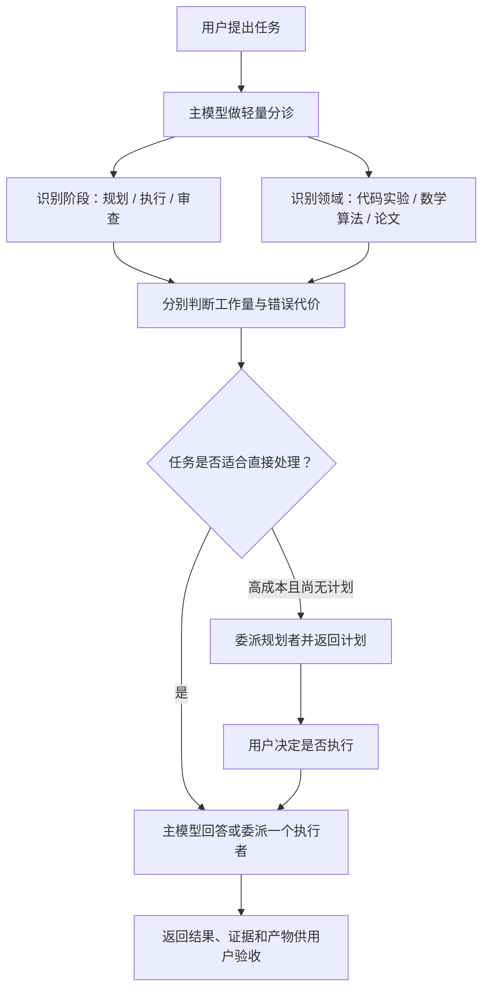

# agent 学术小分队

一个面向 Codex 的轻量学术任务调度 Skill。

它以用户指令为中心，根据任务阶段、学术领域、工作量和决策风险选择处理方式：由主模型直接回答，或委派合适的子代理完成规划、执行与审查，并返回可验收的结果和证据。

## 它解决什么问题

学术工作通常落在三类领域：

- 代码与实验：任务规划、实现、调试、实验设计与执行；
- 数学与算法：公式检查、策略分析、算法构造和形式化证明；
- 论文工作：文献检索、全文阅读、写作、润色、引用、审稿和回复。

这些任务需要的模型、推理强度和上下文并不相同。本 Skill 将“规划”和“执行/审查”分开，并同时判断：

- **工作量成本**：任务会花多少时间、计算和上下文；
- **错误决策代价**：错误结论会不会影响科学主张、实验重跑或重要产物。

高成本任务默认先规划并停下，等待用户决定是否执行；边界清楚的任务可以直接交给合适的执行者。

## 工作方式



核心原则：

- 用户指定的模型和推理强度永远优先于默认路由；
- 默认只派一个子代理，只有真正独立的工作才并行；
- 主模型先判断哪些对话内容需要保留，再选择性继承最近对话或摘录关键信息，并补充中立、可核验的文件与证据索引；
- 包含命令、配置、恢复方案或多个决策分支的长计划会完整保存为 Markdown，聊天回复负责导航而不是过度压缩；
- 规划请求只返回计划，不在同一轮偷偷执行；
- 审查任务默认只报告问题，不擅自修改产物；
- 小任务由主模型直接回答，不为“使用多代理”而使用多代理。

完整规则见 [`SKILL.md`](SKILL.md)，模型选择见 [`references/routing.md`](references/routing.md)。

## 规划产物

用户指定的保存路径始终优先。未指定时，长计划默认保存到：

```text
<codex-home>/agent-academic-squad/plans/<YYYY-MM-DD>/<HHMMSS>-<task-slug>.md
```

`<codex-home>` 从当前 Skill 的安装位置解析，因此该规则可用于不同用户和主机，不依赖固定的 home 路径。

规划文件固定包含以下章节：

1. 结论摘要
2. 待用户决定事项
3. 已验证事实与来源
4. 完整可执行计划
5. 参数、命令与产物路径
6. 验收、恢复与停止条件
7. 成本、风险与模型分配
8. 执行状态

主模型只允许删除调查或推理叙述、完全重复的内容和明确无关的材料。所有待决定分支、参数、依赖步骤、命令、产物路径、验收条件、成本、风险和模型分配都必须保留。

计划文件只是聊天回复的补充，不能替代聊天说明。即使已经保存文件，聊天也必须用自己的语言完整描述整个执行主线，列出全部待用户决定事项及其选项和影响，同时说明关键风险、执行状态和文件绝对路径。详细命令、长配置和大表格可以主要放在文件里，但不能因为存在文件就把聊天缩成几行。

## 默认模型路由

默认值是建议，不是限制：

| 场景 | 默认方向 |
| --- | --- |
| 简短或标准规划 | Sol medium / high |
| 高成本、跨模块规划 | Sol xhigh |
| 常规多文件开发、困难诊断或代码审查 | Sol xhigh |
| 固定且可测试的实验协议执行 | Luna max |
| 数学策略与算法构造 | Sol xhigh |
| 形式化证明或困难推导 | Sol max |
| 大范围文献检索与初筛 | Luna max |
| 全文阅读与长材料证据提取 | Terra max |
| 论文核心写作、重构或投稿级审查 | Sol xhigh |

模型 ID、升级条件与 Codex Radar 规则以 [`references/routing.md`](references/routing.md) 为准。若用户明确指定模型，Skill 不会静默替换。

## 安装

将仓库克隆到 Codex Skills 目录：

```bash
git clone https://github.com/Hantao23/agent-academic-squad.git ~/.codex/skills/agent-academic-squad
```

随后重启 Codex，或开启一个新任务让 Skill 清单重新加载。

该 Skill 依赖支持子代理调度的 Codex 环境。`scripts/radar_snapshot.py` 只使用 Python 3 标准库；只有在模型选择确实可能受当前数据影响时才会访问公开的 Codex Radar 数据源。

## 使用示例

显式调用：

```text
$agent-academic-squad 先规划这个跨模块实验，不要执行，给出预计成本和模型分配。
```

```text
$agent-academic-squad 直接执行已经确认的实验计划，完成后把产物和验证结果返回给我。
```

```text
$agent-academic-squad 用 Sol max 检查这个信息论证明，只报告不成立的步骤和修正建议。
```

```text
$agent-academic-squad 找一个子代理精读这篇论文，再由另一个执行者据此重写方法部分。
```

你随时可以覆盖默认选择：

```text
这次不要 Luna，检索也用 Sol xhigh。
```

```text
不要先规划，直接执行。
```

## 外部学术 Skills

论文类子任务可以继续调用专门的外部 Skill，例如：

- 文献检索与去重：`nature-academic-search`
- 合法全文获取：`nature-downloader`
- 全文阅读：`nature-reader`
- 论文写作与润色：`nature-writing`、`nature-polishing`
- 引用与参考文献核验：`nature-citation`、`nature-ref-verifier`
- 科研绘图与统计审查：`nature-figure`、`nature-statistics`
- 投稿前审稿与审稿回复：`nature-reviewer`、`nature-response`

这些是独立安装的可选能力，不包含在本仓库中。完整映射和边界见 [`references/external-skills.md`](references/external-skills.md)。

## 致谢与来源

本仓库中的 `nature-*` 路由建立在 [Nature Skills](https://github.com/Yuan1z0825/nature-skills) 提供的外部学术工作流之上。感谢项目创始人及维护者袁一哲、核心开发者马昕瑞、主要贡献者胡彬，以及所有 [Nature Skills contributors](https://github.com/Yuan1z0825/nature-skills/graphs/contributors) 的开源工作。

Nature Skills 采用 [Apache License 2.0](https://github.com/Yuan1z0825/nature-skills/blob/main/LICENSE)。本仓库仅提供面向这些外部 Skills 的任务调度和路由规则，不包含或重新发布其实现；安装、使用与再分发相关能力时，请以 Nature Skills 上游仓库为准。

## 仓库结构

```text
agent-academic-squad/
├── SKILL.md                         # 主工作流
├── agents/openai.yaml               # Codex 界面元数据
├── references/routing.md            # 模型与推理强度路由
├── references/external-skills.md    # 外部学术 Skill 映射
└── scripts/radar_snapshot.py        # 可选的 Codex Radar 只读快照
```

## English summary

`agent-academic-squad` is a lightweight Codex skill for user-directed academic delegation. It separates planning from execution, routes code/experiment, mathematics, and paper tasks by workload and decision stakes, combines selected conversation context with neutral evidence indexes, and always lets the user override model choices.
