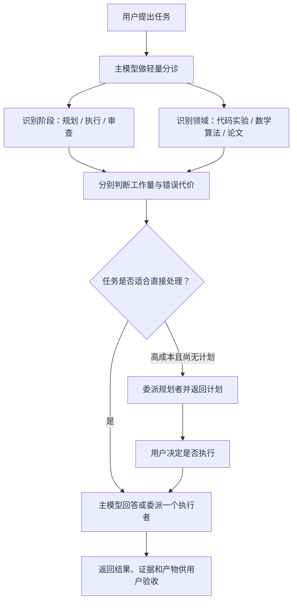

# agent 学术小分队

一个面向 Codex 的轻量学术任务调度 Skill。

它不建立“公司式”的多代理组织，也不引入审批门、任务卡或持久状态机。用户是指挥者，主模型只负责判断任务形态、选择合适的子代理，并把结果交还给用户验收。

## 它解决什么问题

学术工作通常落在三类领域：

- 代码与实验：任务规划、实现、调试、实验设计与执行；
- 数学与算法：公式检查、策略分析、算法构造和形式化证明；
- 论文工作：文献检索、全文阅读、写作、润色、引用、审稿和回复。

这些任务需要的模型、推理强度和上下文并不相同。本 Skill 将“规划”和“执行/审查”分开，并同时判断：

- **工作量成本**：任务会花多少时间、计算和上下文；
- **错误决策代价**：错误结论会不会影响科学主张、实验重跑或重要产物。

高成本任务默认先规划并停下，等待用户决定是否执行；边界清楚的任务可以直接交给合适的执行者。

## 工作方式



核心原则：

- 用户指定的模型和推理强度永远优先于默认路由；
- 默认只派一个子代理，只有真正独立的工作才并行；
- 主模型提供简短、无结论污染的上下文交接，避免子代理重读整个项目；
- 规划请求只返回计划，不在同一轮偷偷执行；
- 审查任务默认只报告问题，不擅自修改产物；
- 小任务由主模型直接回答，不为“使用多代理”而使用多代理。

完整规则见 [`SKILL.md`](SKILL.md)，模型选择见 [`references/routing.md`](references/routing.md)。

## 默认模型路由

默认值是建议，不是限制：

| 场景 | 默认方向 |
| --- | --- |
| 简短或标准规划 | Sol medium / high |
| 高成本、跨模块规划 | Sol xhigh |
| 常规多文件开发、困难诊断或代码审查 | Sol xhigh |
| 固定且可测试的实验协议执行 | Luna max |
| 数学策略与算法构造 | Sol xhigh |
| 形式化证明或困难推导 | Sol max |
| 大范围文献检索与初筛 | Luna max |
| 全文阅读与长材料证据提取 | Terra max |
| 论文核心写作、重构或投稿级审查 | Sol xhigh |

模型 ID、升级条件与 Codex Radar 规则以 [`references/routing.md`](references/routing.md) 为准。若用户明确指定模型，Skill 不会静默替换。

## 安装

将仓库克隆到 Codex Skills 目录：

```bash
git clone https://github.com/Hantao23/agent-academic-squad.git ~/.codex/skills/agent-academic-squad
```

随后重启 Codex，或开启一个新任务让 Skill 清单重新加载。

该 Skill 依赖支持子代理调度的 Codex 环境。`scripts/radar_snapshot.py` 只使用 Python 3 标准库；只有在模型选择确实可能受当前数据影响时才会访问公开的 Codex Radar 数据源。

## 使用示例

显式调用：

```text
$agent-academic-squad 先规划这个跨模块实验，不要执行，给出预计成本和模型分配。
```

```text
$agent-academic-squad 直接执行已经确认的实验计划，完成后把产物和验证结果返回给我。
```

```text
$agent-academic-squad 用 Sol max 检查这个信息论证明，只报告不成立的步骤和修正建议。
```

```text
$agent-academic-squad 找一个子代理精读这篇论文，再由另一个执行者据此重写方法部分。
```

你随时可以覆盖默认选择：

```text
这次不要 Luna，检索也用 Sol xhigh。
```

```text
不要先规划，直接执行。
```

## 外部学术 Skills

论文类子任务可以继续调用专门的外部 Skill，例如：

- 文献检索与去重：`nature-academic-search`
- 合法全文获取：`nature-downloader`
- 全文阅读：`nature-reader`
- 论文写作与润色：`nature-writing`、`nature-polishing`
- 引用与参考文献核验：`nature-citation`、`nature-ref-verifier`
- 科研绘图与统计审查：`nature-figure`、`nature-statistics`
- 投稿前审稿与审稿回复：`nature-reviewer`、`nature-response`

这些是独立安装的可选能力，不包含在本仓库中。完整映射和边界见 [`references/external-skills.md`](references/external-skills.md)。

## 仓库结构

```text
agent-academic-squad/
├── SKILL.md                         # 主工作流
├── agents/openai.yaml               # Codex 界面元数据
├── references/routing.md            # 模型与推理强度路由
├── references/external-skills.md    # 外部学术 Skill 映射
└── scripts/radar_snapshot.py        # 可选的 Codex Radar 只读快照
```

## English summary

`agent-academic-squad` is a lightweight Codex skill for user-directed academic delegation. It separates planning from execution, routes code/experiment, mathematics, and paper tasks by workload and decision stakes, minimizes context rediscovery through neutral warm handoffs, and always lets the user override model choices.

