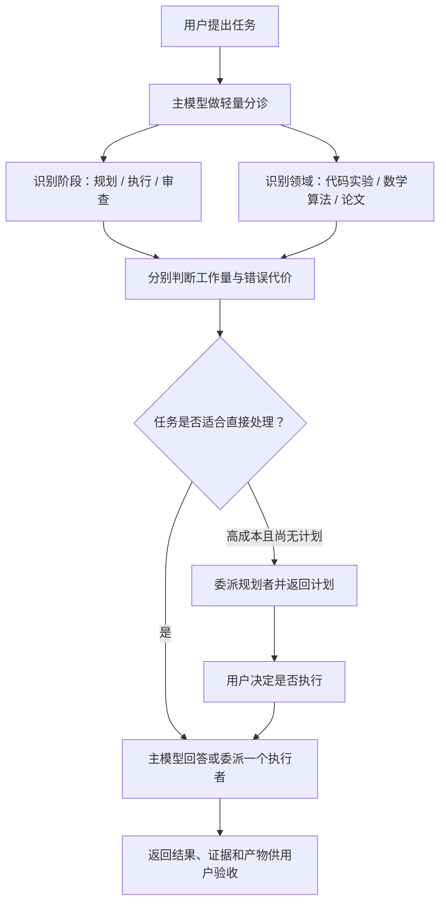

# agent 学术小分队

[English](README.md) | **简体中文**

一个面向 Codex 的轻量学术任务调度 Skill。

它只面向明确的学术任务，并默认按需参与：先确认任务属于科研、科学实验、数学理论与算法研究、学术文献或论文工作，再判断委派是否能带来实质收益。读取一个文件、网页或调用一次工具不会自动触发；只有需要规划、协调、广泛材料处理、专业 Skill 组合或独立审查时，才启用调度。

## 它解决什么问题

学术工作通常落在三类领域：

- 代码与实验：任务规划、实现、调试、实验设计与执行；
- 数学与算法：公式检查、策略分析、算法构造和形式化证明；
- 论文工作：文献检索、全文阅读、写作、润色、引用、审稿和回复。

这些任务需要的模型、推理强度和上下文并不相同。本 Skill 将“规划”和“执行/审查”分开，并同时判断：

- **工作量成本**：任务会花多少时间、计算和上下文；
- **错误决策代价**：错误结论会不会影响科学主张、实验重跑或重要产物。

高成本任务默认先规划并停下，等待用户决定是否执行；边界清楚的任务可以直接交给合适的执行者。

## 工作方式



核心原则：

- 学术领域是第一道硬门槛；普通软件或产品开发、无科研背景的日常代码、商业运营、一般写作、个人事务和常识问答不会隐式触发；
- 不能只因任务出现“代码、数学、分析、写作、规划或审查”等词就认定为学术任务；学术背景不明确时保持不触发；
- 允许隐式触发；当前会话的 `GPT-5.6 Sol medium` 足以承担轻量分诊，不要求先把主模型切到 xhigh；
- 单个文件、摘要、短脚本、小表格、段落润色或一次工具调用本身不足以触发；只有调度确实能改善可靠性时才启用；
- 用户指定的模型和推理强度永远优先于默认路由；
- 默认只派一个子代理，只有真正独立的工作才并行；
- 主模型先判断哪些对话内容需要保留，再选择性继承最近对话或摘录关键信息，并补充中立、可核验的文件与证据索引；
- 学术小分队一旦判定为长计划，就会自动保存完整 Markdown；聊天回复负责说明主线和决策，而不是过度压缩；
- 规划请求只返回计划，不在同一轮偷偷执行；
- 审查任务默认只报告问题，不擅自修改产物；
- 小任务由主模型直接回答，不为“使用多代理”而使用多代理。

完整规则见 [`SKILL.md`](SKILL.md)，模型选择见 [`references/routing.md`](references/routing.md)。

## 规划产物

只要学术小分队已经触发并将规划判定为实质性长计划，就会自动保存，无论 Skill 是显式调用还是隐式触发，也不需要用户再补充“保存计划”。用户可以明确说“不要保存”关闭本次写入。

自动保存分为临时缓存和永久产物：

- 未明确要求永久保存时，计划进入管理型缓存，默认保留 30 天；
- 明确说“保存、保留、永久保存”或指定路径时，计划永久保存；
- 临时计划可在过期前通过“永久保留这个计划”复制到持久路径；
- 判定完成后，主模型立即说明绝对路径、临时或永久状态、保留期限，以及本轮只规划、不执行。

临时缓存默认位于：

```text
${XDG_CACHE_HOME:-$HOME/.cache}/agent-academic-squad/plans/
```

`scripts/plan_cache.py` 在分配新路径时执行惰性清理，只删除该目录中符合自身命名规则、超过 30 天的普通文件；它不使用 `/tmp`、不跟随符号链接，也不删除缓存根目录之外的内容。用户未指定路径的永久计划保存到当前工作区的 `.agents/plans/`。

规划文件固定包含以下章节：

1. 结论摘要
2. 待用户决定事项
3. 已验证事实与来源
4. 完整可执行计划
5. 参数、命令与产物路径
6. 验收、恢复与停止条件
7. 成本、风险与模型分配
8. 执行状态

主模型只允许删除调查或推理叙述、完全重复的内容和明确无关的材料。所有待决定分支、参数、依赖步骤、命令、产物路径、验收条件、成本、风险和模型分配都必须保留。

计划文件只是聊天回复的补充，不能替代聊天说明。即使已经保存文件，聊天也必须用自己的语言完整描述整个执行主线，列出全部待用户决定事项及其选项和影响，同时说明关键风险、执行状态和文件绝对路径。详细命令、长配置和大表格可以主要放在文件里，但不能因为存在文件就把聊天缩成几行。

## 默认模型路由

默认值是建议，不是限制：

| 场景 | 默认方向 |
| --- | --- |
| 简短或标准规划 | Sol medium / high |
| 高成本、跨模块规划 | Sol xhigh |
| 常规多文件开发、困难诊断或代码审查 | Sol xhigh |
| 固定且可测试的实验协议执行 | Luna max |
| 数学策略与算法构造 | Sol xhigh |
| 形式化证明或困难推导 | Sol max |
| 大范围文献检索与初筛 | Luna max |
| 全文阅读与长材料证据提取 | Terra max |
| 论文核心写作、重构或投稿级审查 | Sol xhigh |

模型 ID、升级条件与 Codex Radar 规则以 [`references/routing.md`](references/routing.md) 为准。若用户明确指定模型，Skill 不会静默替换。

## 安装

当前官方 Codex 文档推荐用户级 Skill 放在 `$HOME/.agents/skills`，仓库级 Skill 放在项目的 `.agents/skills`：

```bash
git clone https://github.com/Hantao23/agent-academic-squad.git "$HOME/.agents/skills/agent-academic-squad"
```

```bash
git clone https://github.com/Hantao23/agent-academic-squad.git .agents/skills/agent-academic-squad
```

部分 Codex Desktop 或旧版 Codex 环境可能仍从 `$CODEX_HOME/skills`（通常为 `~/.codex/skills`）发现用户 Skill：

```bash
git clone https://github.com/Hantao23/agent-academic-squad.git "${CODEX_HOME:-$HOME/.codex}/skills/agent-academic-squad"
```

随后重启 Codex，或开启一个新任务让 Skill 清单重新加载。

该 Skill 依赖支持子代理调度的 Codex 环境。`scripts/radar_snapshot.py` 只使用 Python 3 标准库；只有在模型选择确实可能受当前数据影响时才会访问公开的 Codex Radar 数据源。

## Evals

`evals/trigger-routing.csv` 提供40条正例、负例、上下文和边界案例，覆盖是否触发、阶段、领域、委派、外部 Skill、只读约束和用户模型覆盖。`evals/e2e-cases.json` 另有10条富 E2E 案例，可表达多 Skill 路由、子代理数量范围、允许的模型和 effort、预期写入、最终状态及禁止动作。

其中也包含由真实使用任务脱敏概括出的案例：按既有协议启动长时实验、跨多个实验目录做只读证据审查，以及仅向临时目录写入的条件故障实验。仓库不保存原任务对话或私有路径。先运行确定性数据校验、单元测试和 runner dry-run：

```bash
python3 scripts/validate_eval_cases.py
python3 -m unittest discover -s tests -v
python3 scripts/run_e2e_evals.py --dry-run --max-cases 3
```

只有 Codex CLI 凭据有效时才运行真实、隔离的 JSONL 烟雾评测：

```bash
python3 scripts/run_e2e_evals.py --max-cases 3
```

runner 会把当前 Skill 复制到隔离的项目级 Skill 目录，使用 `--json --ephemeral --ignore-user-config --ignore-rules`，按案例选择最小沙箱，遮蔽 API key 形态的字符串，并把已忽略追踪的 trace 和汇总保存到 `evals/results/`。有可用的 `OPENAI_API_KEY` 时可增加 `--strict-isolation`，使用全新的临时 `HOME` 与 `CODEX_HOME`，排除其他用户 Skill。认证、网络和超时失败与 Skill 失败分开报告；Codex JSONL 尚未稳定暴露的路由字段会明确标记为 `unverifiable`。

`.github/workflows/ci.yml` 在每次 push 和 pull request 时运行确定性校验；`.github/workflows/e2e.yml` 仅手动触发，需要仓库的 `OPENAI_API_KEY` secret，默认运行3条并保留脱敏产物14天。数据集校验和 dry-run 不会冒充真实模型评测。

## 使用示例

作为尽力匹配的自然语言快捷触发，可以让消息以“`小分队`”开头；冒号、逗号和空格均可省略。这个快捷词仍依赖 Codex 根据 description 匹配到本 Skill；`$agent-academic-squad` 才是正式显式调用语法。

```text
小分队帮我审查这三个实验目录，按测序深度输出表格。
```

```text
这个交给小分队，只规划，不执行。
```

`不用小分队`、`不要交给小分队`、`不要使用 $agent-academic-squad` 以及仅仅讨论“小分队”的句子不会触发。正式 Skill 语法是：

```text
$agent-academic-squad 先规划这个跨模块实验，不要执行，给出预计成本和模型分配。
```

```text
$agent-academic-squad 直接执行已经确认的实验计划，完成后把产物和验证结果返回给我。
```

```text
$agent-academic-squad 用 Sol max 检查这个信息论证明，只报告不成立的步骤和修正建议。
```

```text
$agent-academic-squad 找一个子代理精读这篇论文，再由另一个执行者据此重写方法部分。
```

你随时可以覆盖默认选择：

```text
这次不要 Luna，检索也用 Sol xhigh。
```

```text
不要先规划，直接执行。
```

## 外部学术 Skills

论文类子任务可以继续调用专门的外部 Skill，例如：

- 文献检索与去重：`nature-academic-search`
- 合法全文获取：`nature-downloader`
- 全文阅读：`nature-reader`
- 论文写作与润色：`nature-writing`、`nature-polishing`
- 引用与参考文献核验：`nature-citation`、`nature-ref-verifier`
- 科研绘图与统计审查：`nature-figure`、`nature-statistics`
- 投稿前审稿与审稿回复：`nature-reviewer`、`nature-response`

这些是独立安装的可选能力，不包含在本仓库中。完整映射和边界见 [`references/external-skills.md`](references/external-skills.md)。

## 致谢与来源

本仓库中的 `nature-*` 路由建立在 [Nature Skills](https://github.com/Yuan1z0825/nature-skills) 提供的外部学术工作流之上。感谢项目创始人及维护者袁一哲、核心开发者马昕瑞、主要贡献者胡彬，以及所有 [Nature Skills contributors](https://github.com/Yuan1z0825/nature-skills/graphs/contributors) 的开源工作。

Nature Skills 采用 [Apache License 2.0](https://github.com/Yuan1z0825/nature-skills/blob/main/LICENSE)。本仓库仅提供面向这些外部 Skills 的任务调度和路由规则，不包含或重新发布其实现；安装、使用与再分发相关能力时，请以 Nature Skills 上游仓库为准。

## 仓库结构

```text
agent-academic-squad/
├── SKILL.md                         # 主工作流
├── LICENSE                          # MIT License
├── README.md                        # 英文文档
├── README.zh-CN.md                  # 简体中文文档
├── .github/workflows/               # 静态 CI 与手动 E2E 工作流
├── agents/openai.yaml               # Codex 界面元数据
├── evals/trigger-routing.csv         # 触发与路由回归案例
├── evals/e2e-cases.json              # 富 E2E 预期
├── references/routing.md            # 模型与推理强度路由
├── references/external-skills.md    # 外部学术 Skill 映射
├── scripts/plan_cache.py             # 临时计划路径与安全清理
├── scripts/radar_snapshot.py         # 可选的 Codex Radar 只读快照
├── scripts/validate_eval_cases.py    # Eval 数据确定性校验
├── scripts/run_e2e_evals.py          # 隔离的 Codex JSONL Eval runner
└── tests/                            # 缓存、评测和 Radar 单元测试
```

## License

本项目采用 [MIT License](LICENSE)。外部 `nature-*` Skills 仍适用各自上游许可证。
