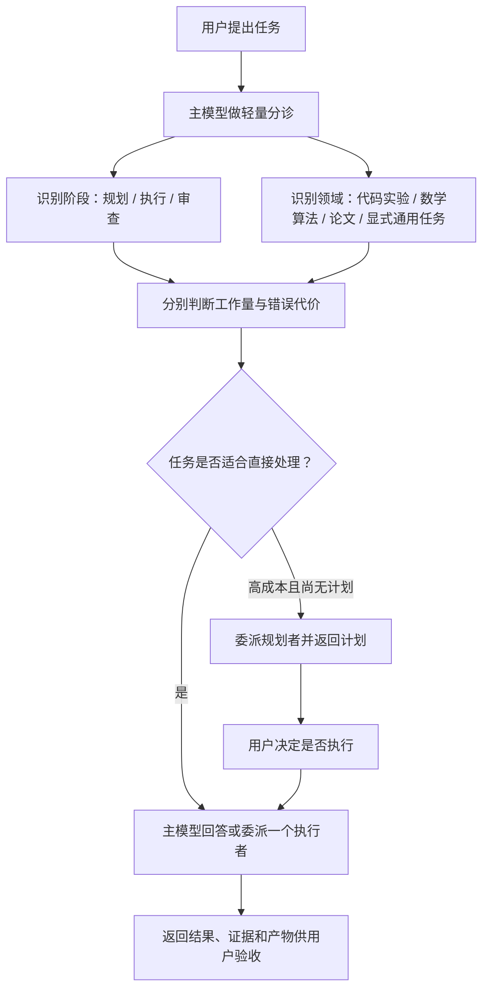

# agent 学术小分队

[English](README.md) | **简体中文**

一个面向 Codex 的轻量、学术优先任务调度 Skill，也支持用户显式交办其他任务。

它只对明确的学术任务开放隐式触发，并继续判断调度能否带来实质收益；用户也可以用正式 `$agent-academic-squad` 或正向“`小分队...`”显式交办非学术任务。读取一个文件、网页或调用一次工具本身不代表需要调度；规划、协调、广泛材料处理、专业 Skill 组合或独立审查确有帮助时，小分队才增加相应处理。

## 它解决什么问题

学术工作通常落在三类领域：

- 代码与实验：任务规划、实现、调试、实验设计与执行；
- 数学与算法：公式检查、策略分析、算法构造和形式化证明；
- 论文工作：文献检索、全文阅读、写作、润色、引用、审稿和回复。

这些任务需要的模型、推理强度和上下文并不相同。本 Skill 将“规划”和“执行/审查”分开，并同时判断：

- **工作量成本**：任务会花多少时间、计算和上下文；
- **错误决策代价**：错误结论会不会影响科学主张、实验重跑或重要产物。

高成本任务默认先规划并停下，等待用户决定是否执行；边界清楚的任务可以直接交给合适的执行者。

## 工作方式



核心原则：

- 使用与任务相称、足够且合适的调度、结构、上下文和输出；不以轻量为理由牺牲质量或完整性，也不在没有收益时增加复杂度；
- 学术领域只约束隐式触发；普通软件或产品开发、无科研背景的日常代码、商业运营、一般写作、个人事务和常识问答不会隐式触发，但用户可以用 `$agent-academic-squad` 或正向“`小分队...`”显式交办；
- 不能只因任务出现“代码、数学、分析、写作、规划或审查”等词就认定为学术任务；学术背景不明确时保持不触发；
- 允许隐式触发；当前会话的 `GPT-5.6 Sol medium` 足以承担轻量分诊，不要求先把主模型切到 xhigh；
- 单个文件、摘要、短脚本、小表格、段落润色或一次工具调用本身不足以触发；只有调度确实能改善可靠性时才启用；
- 用户指定的模型和推理强度永远优先于默认路由；
- 每次小分队完成回答都会说明实际调用了哪些子代理模型、推理强度及任务；没有调用时明确说明“本次未调用子代理”，不报告主模型；
- 默认只派一个子代理，只有真正独立的工作才并行；
- 多阶段任务只识别真正影响结果的依赖，子代理按可独立验证的证据或产物边界拆分，冲突依据证据处理而不是投票；
- 主模型先判断哪些对话内容需要保留，再选择性继承最近对话或摘录关键信息，并补充中立、可核验的文件与证据索引；
- 学术小分队一旦判定为长计划，就会自动保存忠实的 Markdown，但计划文件和聊天都不套用统一模板；
- 管理型缓存只拥有小分队新生成的辅助文本；项目文件和外部 Skill 产物留在原获授权位置，计划只引用路径而不复制；
- 当多个当前可回答的用户决策确实阻塞任务时，小分队可以调用一次 `grilling`，把第一层 frontier 连同建议批量返回，然后停止等待；单个阻塞直接询问；
- 规划请求只返回计划，不在同一轮偷偷执行；
- 审查任务默认只报告问题，不擅自修改产物；
- 小任务由主模型直接回答，不为“使用多代理”而使用多代理。

完整规则见 [`SKILL.md`](SKILL.md)，模型选择见 [`references/routing.md`](references/routing.md)。

## 规划产物

只要学术小分队已经触发并将规划判定为实质性长计划，就会自动保存，无论 Skill 是显式调用还是隐式触发，也不需要用户再补充“保存计划”。用户可以明确说“不要保存”关闭本次写入。

自动保存分为临时缓存和永久产物：

- 未明确要求永久保存时，计划进入管理型缓存，默认保留 30 天；
- 明确说“保存、保留、永久保存”或指定路径时，计划永久保存；
- 临时计划可在过期前通过“永久保留这个计划”复制到持久路径；
- 判定完成后，主模型立即说明绝对路径、临时或永久状态、保留期限，以及本轮只规划、不执行。

临时缓存默认位于：

```text
${XDG_CACHE_HOME:-$HOME/.cache}/agent-academic-squad/plans/
```

`scripts/plan_cache.py` 在分配新路径时执行惰性清理，只删除该目录中符合自身命名规则、超过 30 天的普通文件；它不使用 `/tmp`、不跟随符号链接，也不删除缓存根目录之外的内容。用户未指定路径的永久计划保存到当前工作区的 `.agents/plans/`。

自动保存不会写入原始凭据、访问令牌、私钥，也不会默认复制完整对话。它也不得为了交接而复制、移动、重命名、改写或缓存项目源码、数据集、实验输出、日志、模型权重、图表、论文、PPT 或其他 Skill 生成的产物。这些内容留在原获授权路径，计划只使用路径和必要的证据索引；归属不明确时保持原位。用户明确要求复制、转换、移动或另存到获授权位置时，仍以用户指令为准。用户标记为敏感、机密或“不要存储”的材料只在聊天中返回；除非用户另行给出获授权的保存位置。

规划文件没有强制章节或固定顺序，而是采用最适合当前任务的结构，只保留真正重要的信息。通常应说明目标和主线，并按需要加入证据、依赖、参数、命令、产物路径、未决选择、验收、恢复、成本、风险或模型分配；不适用的内容直接省略，不为满足格式填写空栏目。

计划文件用于补充聊天，而不是迫使两边重复。聊天按任务复杂度说明方案、真正需要用户决定的事项、重要限制、执行状态和文件绝对路径；详细命令、配置和证据表可以留在文件中，重复它们只会浪费 token 时无需再贴一遍。

## 默认模型路由

默认值是建议，不是限制：

| 场景 | 默认方向 |
| --- | --- |
| 简单规划或范围明确的局部代码 | Sol medium |
| 中等复杂度规划或边界清楚的非简单代码，包括常规多文件修改 | Sol high |
| 复杂规划、耦合的跨模块代码、困难诊断或重要审查 | Sol xhigh |
| 关键算法或重大架构决策 | Sol max |
| 固定且可测试的实验协议执行 | Luna max |
| 数学策略与算法构造 | Sol xhigh |
| 形式化证明或困难推导 | Sol max |
| 大范围文献检索与初筛 | Luna max |
| 全文阅读与长材料证据提取 | Terra max |
| 论文核心写作、重构或投稿级审查 | Sol xhigh |

模型 ID、升级条件与 Codex Radar 规则以 [`references/routing.md`](references/routing.md) 为准。若用户明确指定模型，Skill 不会静默替换。

## 安装

当前官方 Codex 文档推荐用户级 Skill 放在 `$HOME/.agents/skills`，仓库级 Skill 放在项目的 `.agents/skills`：

```bash
git clone https://github.com/Hantao23/agent-academic-squad.git "$HOME/.agents/skills/agent-academic-squad"
```

```bash
git clone https://github.com/Hantao23/agent-academic-squad.git .agents/skills/agent-academic-squad
```

部分 Codex Desktop 或旧版 Codex 环境可能仍从 `$CODEX_HOME/skills`（通常为 `~/.codex/skills`）发现用户 Skill：

```bash
git clone https://github.com/Hantao23/agent-academic-squad.git "${CODEX_HOME:-$HOME/.codex}/skills/agent-academic-squad"
```

随后重启 Codex，或开启一个新任务让 Skill 清单重新加载。

该 Skill 依赖支持子代理调度的 Codex 环境。`scripts/radar_snapshot.py` 只使用 Python 3 标准库；只有在模型选择确实可能受当前数据影响时才会访问公开的 Codex Radar 数据源。

## Evals

`evals/trigger-routing.csv` 提供53条正式调用、自然快捷词、隐式触发、负例、上下文和边界案例。`evals/e2e-cases.json` 提供20条核心富 E2E，覆盖宿主加载与按范围路由分离、规划路由与实际代理、medium/high/xhigh 复杂度梯度、允许与必需模型/effort、子代理范围、写入、最终状态、禁止动作、不可用模型、single-writer、用户模型覆盖、非学术显式交办、项目产物归属和临时产物。独立可选集包含两条 Nature 集成案例和一条 `grilling` 批量提问案例，因此普通 E2E 不依赖这些外部 Skill。

其中也包含由真实使用任务脱敏概括出的案例：按既有协议启动长时实验、跨多个实验目录做只读证据审查，以及仅向临时目录写入的条件故障实验。仓库不保存原任务对话或私有路径。先运行确定性数据校验、单元测试和 runner dry-run：

```bash
python3 scripts/validate_eval_cases.py
python3 -m unittest discover -s tests -v
python3 scripts/run_e2e_evals.py --dry-run --max-cases 3
python3 scripts/run_e2e_evals.py --manifest evals/nature-integration-cases.json --dry-run
python3 scripts/run_e2e_evals.py --manifest evals/grilling-integration-cases.json --dry-run
```

只有 Codex CLI 凭据有效时才运行真实、隔离的 JSONL 烟雾评测：

```bash
python3 scripts/run_e2e_evals.py \
  --case e2e-direct-bounded-academic \
  --case e2e-implicit-plan \
  --case e2e-four-directory-read-only-review
```

runner 只把 `SKILL.md`、UI 元数据、运行时参考以及计划缓存/Radar 辅助脚本组成盲测运行包；被测模型看不到仓库 README、评测题与期望答案、测试、workflow 或 runner。receipt schema 由外部 `.eval-harness/` 单独挂载。runner 使用 `--json --ephemeral --ignore-user-config --ignore-rules --output-schema`，按案例选择最小沙箱，遮蔽 API key 形态的字符串，并把 trace、结构化 receipt 和汇总保存到已忽略的 `evals/results/`。工作区快照会比较前后路径全集，检测新增、修改、删除、类型变化、权限变化和符号链接目标变化，也不会排除被复制的 Skill。四目录审查使用真正的目录和文件 fixture，不再把全部证据塞进 prompt。

评测结果分为 `pass`、`fail` 和 `inconclusive`，每条案例会显式声明必需的证据来源。缺少可选 trace 会被记录，但不会让正确的普通行为案例失效；缺少必需证据仍为 `inconclusive`。结构化 receipt 只是模型自述，runner 还会检查其字段间语义是否自洽。JSONL 中无法归属的通用 model/effort 字段只作诊断；只有明确归属于子代理的记录才用于强路由核验。增加 `--strict` 后，`fail` 和 `inconclusive` 都会返回非零。每份汇总还会记录 runner 提交与哈希、manifest 哈希和平台。

有可用的 `CODEX_API_KEY` 时可增加 `--strict-isolation`，使用全新的临时 `HOME` 与 `CODEX_HOME`，排除其他用户 Skill。runner 通过小型正向白名单构造子进程环境，只传入选定的 `CODEX_API_KEY`；无关的环境凭据和令牌不会被继承。认证、网络、外部 Skill 缺失和超时会与 Skill 行为失败分开报告。

只有安装了外部 Nature Skills 时才运行可选集成集：

```bash
python3 scripts/run_e2e_evals.py \
  --manifest evals/nature-integration-cases.json \
  --external-skill-root "$HOME/.agents/skills" \
  --strict
```

安装了 `grilling` 后，可以运行一轮式阻塞澄清集成案例：

```bash
python3 scripts/run_e2e_evals.py \
  --manifest evals/grilling-integration-cases.json \
  --external-skill-root "$HOME/.agents/skills" \
  --strict
```

`.github/workflows/ci.yml` 在每次 push 和 pull request 时运行确定性校验；`.github/workflows/e2e.yml` 仅手动触发，需要仓库的 `OPENAI_API_KEY` secret，但只在 E2E runner 步骤中将其暴露为 `CODEX_API_KEY`。维护者可选择3条代表案例或全部20条核心案例，脱敏产物保留14天。checkout、环境安装、依赖安装和产物上传步骤都无法读取密钥。数据集校验和 dry-run 不会冒充真实模型评测。

## 使用示例

作为尽力匹配的自然语言快捷触发，可以让消息以“`小分队`”开头；冒号、逗号和空格均可省略。这个快捷词仍依赖 Codex 根据 description 匹配到本 Skill；`$agent-academic-squad` 才是正式显式调用语法。

```text
小分队帮我审查这三个实验目录，按测序深度输出表格。
```

```text
这个交给小分队，只规划，不执行。
```

`不用小分队`、`不要交给小分队` 等自然语言否定，以及仅仅讨论“小分队”的句子，不会触发快捷词。学术范围只限制隐式触发；`$agent-academic-squad` 或正向“`小分队...`”会显式启用这套调度，也可以用于非学术任务。引号或代码里的字面提及不算交办。显式启用不会绕过安全、授权或用户的真实指令，也不代表简单任务必须派子代理。正式用法例如：

```text
$agent-academic-squad 先规划这个跨模块实验，不要执行，给出预计成本和模型分配。
```

```text
$agent-academic-squad 直接执行已经确认的实验计划，完成后把产物和验证结果返回给我。
```

```text
$agent-academic-squad 用 Sol max 检查这个信息论证明，只报告不成立的步骤和修正建议。
```

```text
$agent-academic-squad 审查这份复杂的跨团队产品迁移方案，找出依赖和回滚缺口，不要修改。
```

```text
$agent-academic-squad 找一个子代理精读这篇论文，再由另一个执行者据此重写方法部分。
```

你随时可以覆盖默认选择：

```text
这次不要 Luna，检索也用 Sol xhigh。
```

```text
不要先规划，直接执行。
```

## 外部 Skills

当多个相互关联、必须由用户决定且当前可以同时回答的阻塞项出现时，小分队可以调用一次独立安装的 `grilling`。它把当前 frontier 连同建议一次性批量返回后停止；单个简单问题、可自行调查的事实或自动多轮追问不会触发它。

论文类子任务可以继续调用专门的外部 Skill，例如：

- 文献检索与去重：`nature-academic-search`
- 合法全文获取：`nature-downloader`
- 全文阅读：`nature-reader`
- 论文写作与润色：`nature-writing`、`nature-polishing`
- 引用与参考文献核验：`nature-citation`、`nature-ref-verifier`
- 科研绘图与统计审查：`nature-figure`、`nature-statistics`
- 投稿前审稿与审稿回复：`nature-reviewer`、`nature-response`

这些是独立安装的可选能力，不包含在本仓库中。完整映射和边界见 [`references/external-skills.md`](references/external-skills.md)。

## 致谢与来源

本仓库中的 `nature-*` 路由建立在 [Nature Skills](https://github.com/Yuan1z0825/nature-skills) 提供的外部学术工作流之上。感谢项目创始人及维护者袁一哲、核心开发者马昕瑞、主要贡献者胡彬，以及所有 [Nature Skills contributors](https://github.com/Yuan1z0825/nature-skills/graphs/contributors) 的开源工作。

Nature Skills 采用 [Apache License 2.0](https://github.com/Yuan1z0825/nature-skills/blob/main/LICENSE)。本仓库仅提供面向这些外部 Skills 的任务调度和路由规则，不包含或重新发布其实现；安装、使用与再分发相关能力时，请以 Nature Skills 上游仓库为准。

一轮式阻塞澄清路线建立在 Matt Pocock Skills 仓库提供的外部 [`grilling` Skill](https://github.com/mattpocock/skills/tree/main/skills/productivity/grilling) 之上。其当前上游工作流支持在每轮批量询问整个已解锁 frontier，并采用 [MIT License](https://github.com/mattpocock/skills/blob/main/LICENSE)。本仓库只提供路由和“一轮后停止”的约束，不重新发布其实现。

## 仓库结构

```text
agent-academic-squad/
├── SKILL.md                         # 主工作流
├── LICENSE                          # MIT License
├── README.md                        # 英文文档
├── README.zh-CN.md                  # 简体中文文档
├── .github/workflows/               # 静态 CI 与手动 E2E 工作流
├── agents/openai.yaml               # Codex 界面元数据
├── evals/trigger-routing.csv         # 触发与路由回归案例
├── evals/e2e-cases.json              # 核心 E2E 预期
├── evals/nature-integration-cases.json # 可选 Nature 集成集
├── evals/grilling-integration-cases.json # 可选一轮式 grilling 集成集
├── evals/receipt-schema.json         # 结构化自述 schema
├── evals/fixtures/                   # 真实读写 E2E fixture
├── references/routing.md            # 模型与推理强度路由
├── references/external-skills.md    # 外部 Skill 映射
├── scripts/plan_cache.py             # 临时计划路径与安全清理
├── scripts/radar_snapshot.py         # 可选的 Codex Radar 只读快照
├── scripts/validate_eval_cases.py    # Eval 数据确定性校验
├── scripts/run_e2e_evals.py          # 隔离的 Codex JSONL Eval runner
└── tests/                            # 缓存、评测和 Radar 单元测试
```

## License

本项目采用 [MIT License](LICENSE)。外部 `nature-*` Skills 仍适用各自上游许可证。
